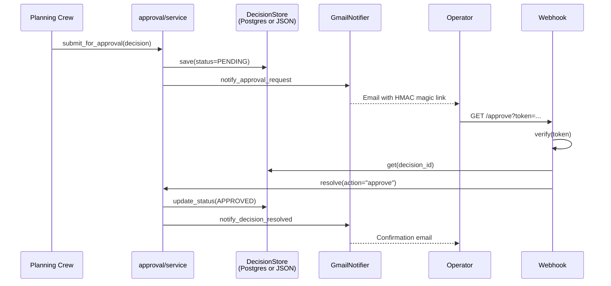

# Architecture

This doc explains how the pieces fit together. Read it once and the rest of the codebase becomes navigable.

## The mental model

`minions` is **a Decision Record approval graph wrapped in a CrewAI-shaped engineering org.** Every meaningful action an agent wants to take becomes a Decision Record, which lands in an approval queue, which the operator (you) resolves through any of three equivalent surfaces (CLI, Streamlit dashboard, email magic-link).

Defensible autonomy comes from four hard layers:

1. **Prompt safety preamble** prepended to every agent's system prompt (`src/minions/agents/safety.py`).
2. **Tooling deny-list** — the in-process GitHub client has no `merge` method and refuses pushes to protected branches (`src/minions/github/client.py`).
3. **Branch protection** on `main` enforced by GitHub (operator-configured).
4. **Egress allowlist** at the runtime sandbox layer (operator-configured).

Layers 3 and 4 live outside the codebase. Layers 1 and 2 are the contract this project ships and defends.

---

## High-level flow

```mermaid
flowchart LR
    subgraph Cron[Scheduled triggers]
        weekly[Monday 09:00<br/>weekly planning]
        daily[Daily 09:00<br/>monitor + audit]
        friday[Friday 16:00<br/>digest]
    end

    subgraph Crews[CrewAI agents]
        plan[Planning crew<br/>PO → Manager → Devil's Advocate]
        eng[Engineer crew<br/>opens draft PRs]
        audit[Audit crew<br/>code/process/cost/DA]
    end

    subgraph Spine[Approval spine]
        store[(Decision Store<br/>JSON or Postgres)]
        svc[approval/service.py<br/>submit + resolve]
        graph[approval/graph.py<br/>LangGraph state machine]
    end

    subgraph Operator[Operator surfaces]
        cli[CLI<br/>minions decisions ...]
        dash[Streamlit dashboard]
        email[Gmail magic link<br/>72h HMAC token]
        webhook[FastAPI webhook<br/>/approve /reject]
    end

    weekly --> plan
    daily --> audit
    plan --> svc
    eng --> svc
    audit --> svc
    svc --> store
    svc --> graph
    svc -.notify.-> email
    email --> webhook --> svc
    cli <--> store
    dash <--> store
    cli -. resolve .-> svc
    dash -. resolve .-> svc
```

A Decision goes from PENDING → APPROVED or REJECTED. The Engineer crew only ever consumes APPROVED Decisions.

---

## The spine, file by file

### Manifest + portfolio config (`config/`, `projects/`, `models/manifest.py`)
YAML in `config/portfolio.yaml` plus per-project `projects/*.yaml` describes which repos the org manages and at what cadence/budget. The loader skips `_deferred/`. Every project sets a `cadence_profile` (v0_frugal / v1_balanced / v2_full) which the orchestrator consults for scheduling.

### Roles + tiers (`models/roles.py`, `agents/roster.py`)
Every role (Product Owner, Principal, Manager, Engineer, etc.) maps to a target Claude model tier (Opus / Sonnet / Haiku). Tier selection happens at agent construction time and projects can override (`tier_overrides:` in their manifest).

### MinionAgent → CrewAI bridge (`agents/base.py`, `crews/factory.py`)
`MinionAgent` is the framework-agnostic wrapper. `make_crewai_agent()` translates it into a `crewai.Agent` with the right LLM (`llm.py`) and the safety preamble prepended to the system prompt. **The four hard rules in `safety.py` are non-negotiable** — they are layer 1 of 4 defenses.

### Crews (`crews/planning.py`, `crews/engineer.py`, `crews/devils_advocate.py`)
Sequential CrewAI crews. Planning produces a sprint Decision Record; Engineer (in progress) consumes an approved one. `@observe_crew` wraps each run for Langfuse traces (no-op when creds missing).

### Approval pipeline (`approval/`)
- `store.py` — JSON `DecisionStore` over `data/local/decisions.json`.
- `store_postgres.py` — Postgres implementation using `psycopg`.
- `store_factory.py:make_decision_store()` picks per env (`MINIONS_STORE_BACKEND` or auto-detect via `MINIONS_DATABASE_URL`).
- `service.py` — `submit_for_approval()` / `resolve()` mutate state and fan out to notifiers.
- `graph.py` — LangGraph state machine (notify → interrupt → resolve), `InMemorySaver` for v0; designed to swap to `SqliteSaver`/`PostgresSaver` without rewriting nodes.
- `tokens.py` — HMAC-signed magic-link tokens, 72h TTL, timing-safe verify.

Audit findings and Engineer runs follow the same dual-backend pattern (`audit/store_*.py`, `crews/engineer_runs_store_*.py`).

### Notifiers (`notify/`)
Pluggable. `ConsoleNotifier` is default; `GmailNotifier` activates when `MINIONS_NOTIFIER=gmail` and the app password resolves. Missing secret → fall back to console with a warning, **never silent failure**.

### Secrets (`secrets.py`)
Chain of backends, first hit wins:
1. `EnvBackend` — `MINIONS_SECRET_<NAME_UPPER>` env var
2. `AwsSecretsManagerBackend` — `minions/<name>` secret in AWS Secrets Manager

The AWS backend swallows missing-creds/region/secret silently so dev works without AWS, but **propagates `AccessDenied`** so misconfigured IAM is loud.

### GitHub client (`github/`)
Deliberately scoped: **no merge method exists**, refuses `main`/`master`/`trunk`/`develop`, defaults PRs to draft. Token resolution: `GITHUB_TOKEN` env → AWS `minions/github-token` → `gh auth token`.

### Webhook (`webhook/app.py`)
Tiny FastAPI app for the magic-link round trip. Verifies HMAC token, looks up Decision via `make_decision_store()`, calls `resolve()`, renders confirmation HTML. Designed for Fly.io; sleeps when idle.

---

## Decision lifecycle



If 72 hours pass without a click, the magic-link token expires AND `sweep_timeouts()` auto-rejects the Decision (the daily cron runs this). That keeps the queue clean and prevents stale tokens from being usable later.

---

## Conventions and gotchas

- **Never weaken the four safety rules** in `agents/safety.py` or the GitHub client's branch refusal — they're the encoded contract with the operator.
- **Stores are dual-backend (JSON ↔ Postgres) by env.** Default falls back to JSON when no `MINIONS_DATABASE_URL` resolves; CI sets the URL for Postgres-path coverage. When adding a new store, mirror this pattern: implementation file + `_postgres.py` + `_factory.py` + a Postgres-shaped table in `db/migrations/`. Don't reach into a raw JSON path from new code — go through the factory.
- **Dry-run is the default** for any command that would spend money (`plan`, future `engineer`). When adding new crew commands, follow the same pattern (`--no-dry-run` opt-in, dry-run prints intended actions).
- **Langfuse + Gmail + AWS are all optional in dev.** Code paths must degrade to no-op or console fallback without raising. Don't add hard import-time requirements on these.
- `mypy` is **strict** (`disallow_untyped_defs`, `strict = true`); third-party libs without stubs are explicitly ignored in `pyproject.toml` `[[tool.mypy.overrides]]` — extend that list rather than weakening strictness.
- Ruff selects `E,F,I,N,B,UP,C4,T10,T20,PT,RET,SIM` — notably `T20` bans `print` in `src/`; use `rich` console or `typer.echo` from CLI commands.
- The `.env` file at repo root is auto-loaded on orchestrator startup (Langfuse creds etc.) — **never read or commit it** (also covered by safety rules and `.gitignore`).

---

## Observability — watching the org work

Two complementary surfaces:

- **Streamlit dashboard** (`minions dashboard`) — five pages, no extra infra. The **📡 Activity** page renders a chronological stream of every `crew_started` / `crew_finished` / `crew_failed` event from `data/local/activity.jsonl` (or the `activity_log` Postgres table), with a always-on guardrails strip that names the four safety layers. This is the default UX and is sufficient for solo operators.
- **Langfuse** — opt-in. `crews/*.py` wrap each run with `@observe_crew`; when `LANGFUSE_*` env vars resolve, full LLM traces flow there. When they don't, the decorator is a no-op. Use this when you need token-level traces for debugging multi-agent reasoning.

For a contributor-facing visual tour of every role, cron trigger, and Decision lifecycle, see [`docs/AGENTS.md`](docs/AGENTS.md).

---

## Where to start reading

If you only have 30 minutes:

1. `src/minions/agents/safety.py` — the contract.
2. `src/minions/models/decision.py` — the data shape.
3. `src/minions/approval/service.py` — how Decisions move.
4. `src/minions/crews/planning.py` — example crew.
5. `src/minions/webhook/app.py` — how the loop closes.

Tests in `tests/test_approval_service.py`, `tests/test_planning_crew.py`, and `tests/test_webhook.py` mirror these and read like documentation.
