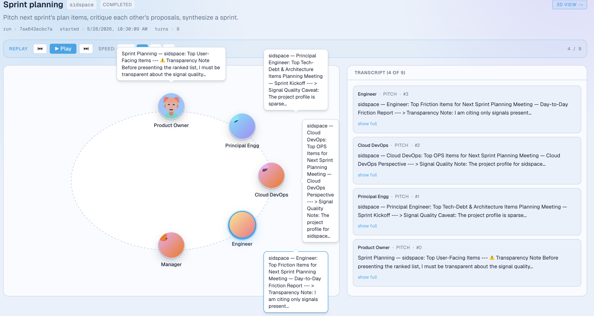
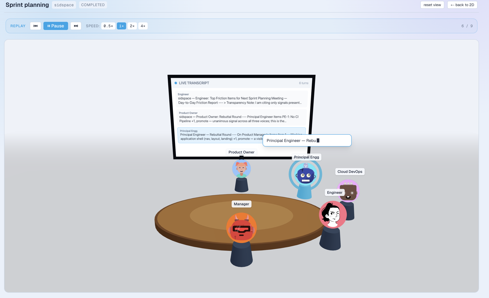
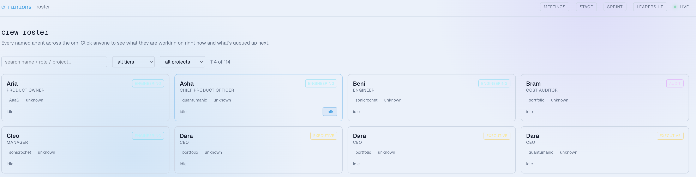
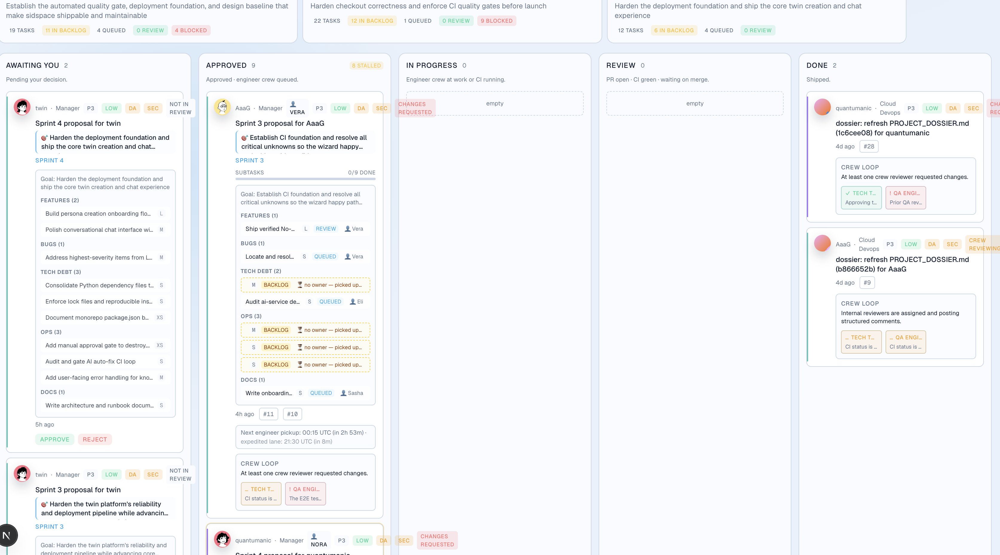

<div align="center">

# 🐝 minions

**An autonomous AI engineering *organization* — not a single coding agent, but a whole org of role-based AI agents that plan, build, review, and ship software across a portfolio of projects. You are the only human, and you sit at the top as the approver.**

[](LICENSE)
[](https://www.python.org/)
[](https://nextjs.org/)

[What it is](#what-it-is) · [Screenshots](#screenshots) · [How it works](#how-it-works) · [Quickstart](#quickstart) · [Architecture](#architecture) · [Contributing](#contributing)

</div>

---

## What it is

Most "AI coding agents" are a single assistant in your editor. **minions is different: it models an entire software org.**

There's a Product Owner, a Principal Engineer, a Manager, Engineers, a Code Auditor, a Security Champion, a Devil's Advocate, and an executive bench (CEO/CTO/MD) — each a named AI agent with its own role, model tier, and seat at the table. They run real Agile rituals (sprint planning, scrum, code audits, retros), produce **Decision Records**, and open **draft pull requests**.

**Every meaningful action passes through a human approval gate.** Nothing merges to `main` without you. The agents propose; you dispose. That single constraint — *human-in-the-loop by construction* — is the spine of the whole system.

You watch it all happen in a live operator console: a **meeting room** where you see the agents debate around a round-table (in 2D *or* 3D), a **roster** of your named agents, a **sprint board**, cost tracking, and a questions inbox where blocked agents ask *you*.

> **Status:** Active development, dogfooded daily on its own portfolio of projects. It works end-to-end (plan → approve → build → PR → review) and is genuinely fun to watch — but it's young, opinionated, and evolving fast. Issues and PRs very welcome.

---

## Screenshots

> 📸 _Drop images into `docs/screenshots/` with the filenames below and they'll render here._

| Live meeting room (2D round-table) | 3D round-table |
|---|---|
|  |  |

| Roster of named agents | Sprint board |
|---|---|
|  |  |

---

## How it works

```
  YOU (operator / CEO)
        ▲  approve / reject / answer questions
        │
  ┌─────┴───────────────────────────────────────────────┐
  │  Decision Records  ──►  Approval gate  ──►  Execution │
  └──────────────────────────────────────────────────────┘
        ▲                                          │
        │ propose                                  │ open draft PR
  ┌─────┴───────────┐   ┌───────────────┐   ┌──────▼─────────┐
  │ Planning crew   │   │ Audit/Security │   │ Engineer crew  │
  │ PO·Principal·Mgr│   │ Devil's Adv.   │   │ writes the code│
  └─────────────────┘   └───────────────┘   └────────────────┘
```

1. **Plan.** A planning crew (Product Owner → Principal Engineer → Manager, with a Devil's Advocate critique) debates and produces a sprint **Decision Record**.
2. **Approve.** The Decision lands in your inbox (console / email). Nothing proceeds until you approve.
3. **Build.** On approval, the Engineer crew implements the work and opens a **draft PR** — never merging, never touching `main`.
4. **Review.** Code Auditor, Security Champion, and QA review the PR and post structured verdicts.
5. **Observe.** Every step streams into the operator console as a live "meeting," and every LLM call is cost-tracked and trace-able.

It runs itself on a cadence (weekly planning, scrum every other day, daily monitoring) via scheduled jobs — but always stops at the approval gate.

### Safety is built in, in four layers

This is the part we take most seriously. AI agents with repo access need hard guarantees:

1. **Prompt** — every agent's system prompt carries four non-negotiable rules.
2. **Tooling** — filesystem deny-list (`.env*`, `*.pem`, `*.key`, `credentials*`); the GitHub client *has no merge method* and refuses `main`/`master`/`trunk`/`develop`; PRs default to draft.
3. **Platform** — GitHub branch protection; the App scope excludes secrets.
4. **Network** — egress allowlist (Anthropic, GitHub, Gmail, Langfuse, Neon, AWS only).

---

## Quickstart

minions is two pieces: the **Python orchestrator** (the agent org + CLI) and the **Next.js operator console** (`web/`). You can run either independently. The orchestrator works fully offline in dry-run mode — **no API keys, no cloud, $0.**

### 1. The agent org (Python)

```bash
git clone https://github.com/sagacioussid02/minions
cd minions

# uv recommended (fast); pip works too
uv venv && uv pip install -e ".[dev]"
#   or: python3.12 -m venv .venv && source .venv/bin/activate && pip install -e ".[dev]"

minions check                 # validate config + manifests
minions org                   # print the full org topology + model tiers
minions roster                # see the named agents

# Run the full plan → decision → approve loop with ZERO spend:
minions plan demo             # dry-run by default — no LLM calls, $0
minions decisions list        # the Decision it produced
minions decisions approve <id-prefix>
```

To run *real* planning (spends a few cents on Claude):

```bash
export ANTHROPIC_API_KEY=sk-ant-...
minions plan demo --no-dry-run
```

### 2. The operator console (web dashboard)

```bash
cd web
pnpm install
cp ../.env.example .env.local   # set DATABASE_URL (Neon Postgres) — see below
pnpm dev                        # → http://localhost:3000
```

The dashboard reads from the same Postgres the orchestrator writes to. Point `DATABASE_URL` at a [Neon](https://neon.tech) database (free tier is plenty). With an empty DB the UI renders cleanly with empty states; run the orchestrator to populate live meetings, roster, and the sprint board.

That's it — clone, install, run. No required external services for the dry-run path.

---

## Architecture

The system is organized around **Decision Records flowing through an approval graph**. A few load-bearing ideas:

- **Roles → model tiers.** Every role maps to a Claude tier (Opus / Sonnet / Haiku) so cheap work runs cheap and hard work runs strong.
- **Crews.** Sequential [CrewAI](https://crewai.com) crews: planning, engineer, code-audit, security, devil's-advocate, QA, portfolio-review.
- **Approval pipeline.** Durable Decision store + a [LangGraph](https://www.langchain.com/langgraph) state machine (notify → interrupt → resolve) + HMAC-signed magic-link approvals.
- **Dual-backend stores.** Every persistent object has a JSON backend (local dev) and a Neon Postgres backend (production), chosen by env. Same interface either way.
- **Observability.** [Langfuse](https://langfuse.com) traces every crew run when configured; a true no-op when not.
- **The console.** A Next.js 16 app that reads the activity log + transcripts and renders the org as a living, watchable place.

📖 **Deep dive:** [`ARCHITECTURE.md`](ARCHITECTURE.md)

```
minions/
├── src/minions/          # the orchestrator
│   ├── agents/           # MinionAgent + the four safety rules
│   ├── crews/            # planning, engineer, audit, security, ...
│   ├── approval/         # Decision store, service, LangGraph, tokens
│   ├── scheduled/        # cron entrypoints (weekly plan, scrum, monitor)
│   ├── transcripts/      # crew transcript capture → the meeting feed
│   └── __main__.py       # the `minions` CLI
├── web/                  # the Next.js operator console
├── config/ & projects/   # portfolio + per-project manifests
└── tests/                # ~700 tests
```

---

## Contributing

**We'd genuinely love your help** — and there's a comfortable on-ramp: most of the codebase runs locally with no API keys, and the test suite runs in seconds.

```bash
uv pip install -e ".[dev]"
pytest          # should be green on a clean clone
ruff check src tests && mypy src
```

Great first contributions: dashboard/UX polish (`web/`), new CLI commands, more crew rituals, docs, and bug fixes (most carry a regression test). Look for [`good first issue`](https://github.com/sagacioussid02/minions/labels/good%20first%20issue).

One thing that makes this project unusual: **it's a framework for accountable AI engineering, so we hold contributions to the same bar** — AI-assisted PRs are explicitly welcome, but they must be human-reviewed, disclosed, and scoped. Full details (including the safety-critical files that need maintainer review) are in **[`CONTRIBUTING.md`](CONTRIBUTING.md)**.

By participating you agree to the [Code of Conduct](CODE_OF_CONDUCT.md). Security issues: see [`SECURITY.md`](SECURITY.md) — please don't open public issues for those.

---

## License

[MIT](LICENSE) © 2026 Siddharth Shankar and contributors. Use it, fork it, build your own org.
