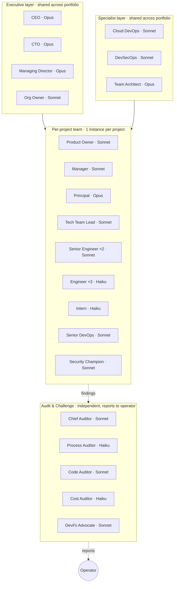
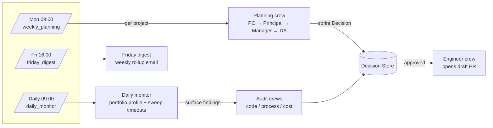
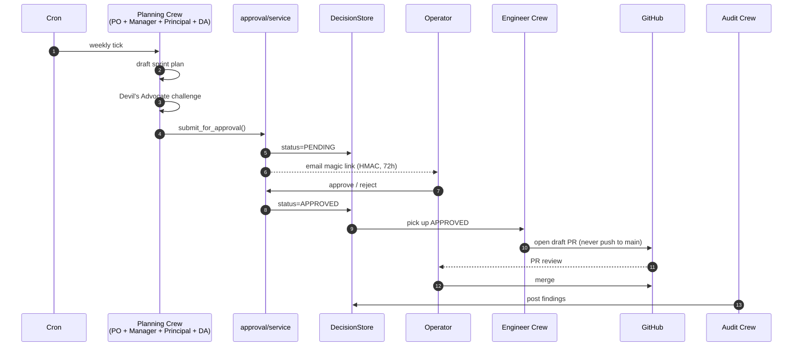

# Agents — a contributor's tour

This is the visual map of the org. If you've cloned the repo and want to know *who is in here, when do they wake up, and what do they actually do*, read this end-to-end. Everything here is derived from `src/minions/agents/roster.py`, `src/minions/models/roles.py`, and `src/minions/scheduled/`.

> **TL;DR** — Three layers of agents (Executive, per-Project Team, Audit) wake on three cron triggers (weekly / daily / friday). Every meaningful thing they want to do becomes a Decision Record that *you* approve. The Engineer crew only ever consumes APPROVED Decisions.

---

## 1. Org topology

**Tier reference (v0_frugal cadence):** Opus is downgraded to Sonnet by default to keep cost discipline at $15–30/mo. Switch to `v1_balanced` or `v2_full` in `config/portfolio.yaml` to restore Opus on Principal / CEO / CTO / MD / Team Architect. See `src/minions/models/roles.py`.

---

## 2. When does each agent wake up?

There are exactly three cron entrypoints. Everything else is operator-triggered (CLI, dashboard).

| Trigger | Who runs | Output |
|---|---|---|
| `minions cron weekly` (Mon 09:00) | Planning crew per project | One sprint Decision Record per project, status PENDING |
| `minions cron daily`  (every day) | Daily monitor + Audit crews + timeout sweep | Audit findings; auto-rejects PENDING Decisions older than 72h |
| `minions cron friday` (Fri 16:00) | Friday digest | One summary email to operator |

The Engineer crew is **not** on a cron — it picks up APPROVED Decisions. Today that's manual (`minions engineer run <id>`); making it loop on approval is a tracked work item.

---

## 3. Roles, by what they actually produce

Every role's job is to produce something concrete. If a role has no output type listed, it's a reviewer/challenger that influences other roles' outputs rather than producing its own.

### Executive layer (shared)
| Role | Activates when | Produces |
|---|---|---|
| **CEO** | Quarterly strategy decisions, escalations | `org_strategy` Decision Records |
| **CTO** | Cross-project architecture decisions | `tech_strategy` Decisions |
| **Managing Director** | Resource allocation across portfolio | `team_composition` Decisions |
| **Org Owner** | Operational guardian of 1–2 projects | (reviews; no own output) |

### Specialist layer (shared)
| Role | Activates when | Produces |
|---|---|---|
| **Cloud DevOps** | Infra change requested by any project | Infra `engineering_task` Decisions |
| **DevSecOps** | Security-relevant change on any project | Security findings + `security_task` Decisions |
| **Team Architect** | Cross-cutting design questions | Design notes attached to Decisions |

### Per-project team
| Role | Activates when | Produces |
|---|---|---|
| **Product Owner** | Weekly planning | Sprint goals, prioritized backlog |
| **Manager** | Weekly planning, daily monitor | Sprint Decision Record (the canonical weekly output) |
| **Principal Engineer** | Weekly planning, complex design issues | Technical direction inside Decisions |
| **Tech Team Lead** | Weekly planning, daily monitor | Task breakdown / dependencies |
| **Senior Engineer** ×2 | Engineer crew runs | Draft PRs (via Engineer crew) |
| **Engineer** ×3 | Engineer crew runs (default seat) | Draft PRs |
| **Intern** | Optional, low-stakes tasks only | Draft PRs (heavily reviewed) |
| **Senior DevOps** | Infra-shaped tasks for this project | Draft PRs touching infra |
| **Security Champion** | Optional, on security-sensitive projects | Security review notes on Decisions |

### Audit & Challenge (independent — reports to operator)
| Role | Activates when | Produces |
|---|---|---|
| **Chief Auditor** | Daily | Coordinates the audit sweep |
| **Process Auditor** | Daily, after merged PR | `process` audit findings |
| **Code Auditor** | After merged PR (sampled by risk) | `code` audit findings |
| **Cost Auditor** | Daily | `cost` audit findings (token/$ anomalies) |
| **Devil's Advocate** | Inside planning crew, before sprint Decision is submitted | Counter-arguments inlined in the Decision |

> **Sampling:** high-risk decisions audited 100%, medium 50%, low 25%. See `src/minions/audit/runner.py`.

---

## 4. Lifecycle of a single Decision Record

This is the core loop. Every agent action that costs money, ships code, or changes shared state goes through it.

If the operator never clicks: at +72h `sweep_timeouts()` (run by the daily cron) auto-rejects, the magic-link token expires, the queue stays clean.

---

## 5. Watching it happen — the dashboard

`minions dashboard` opens five pages on `http://localhost:8501`:

| Page | What it answers |
|---|---|
| 🤖 **Agents** | Which (project, role) buckets are active / idle / stale, with cost sparklines |
| 📡 **Activity** | Live timeline of every `crew_started` / `crew_finished` / `crew_failed` event, plus the four-layer guardrails strip |
| 📋 **Decisions** | Pending queue, drill-down, in-dashboard approve / reject |
| 📊 **Sprint Board** | Per-project kanban (pending → approved → in-progress → PR open → done) |
| 🛡️ **Audit** | Open findings by severity, with PR/decision links |

The **📡 Activity** page is the fastest way to convince yourself the system is doing what it claims — the guardrails strip is always-visible, and every crew run leaves a row.

---

## 6. Where to look in code

| You want to understand… | Read this |
|---|---|
| The four safety rules every agent obeys | `src/minions/agents/safety.py` |
| Role → model tier mapping | `src/minions/models/roles.py` |
| Who composes the per-project team | `src/minions/agents/roster.py:PER_PROJECT_TEMPLATE` |
| What a Decision looks like on disk | `src/minions/models/decision.py` + `data/local/decisions.json` |
| What an Activity event looks like | `src/minions/activity.py` + `data/local/activity.jsonl` |
| The cron entrypoints | `src/minions/scheduled/{weekly_planning,daily_monitor,friday_digest}.py` |
| The planning crew | `src/minions/crews/planning.py` |
| The Engineer crew | `src/minions/crews/engineer.py` |

A 30-minute reading order is in [`ARCHITECTURE.md`](../ARCHITECTURE.md#where-to-start-reading).
